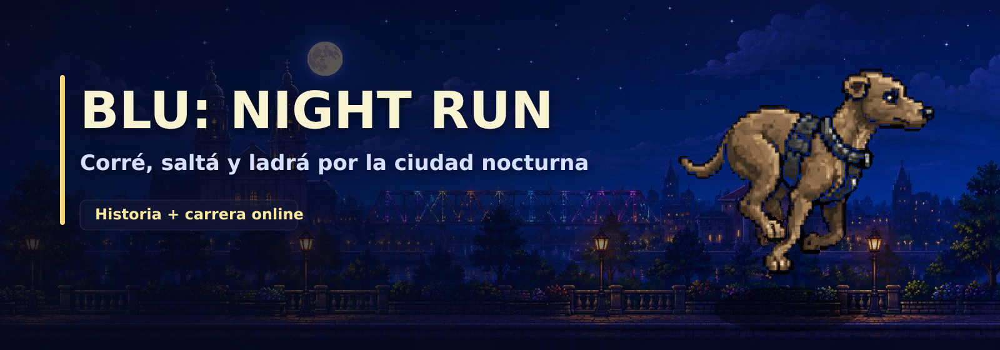

# Blu: Night Run

Este repositorio publica los instaladores y archivos de actualización de **Blu: Night Run**. Acá viven las releases públicas del juego y el `latest.json` que usa el auto-updater de la app de escritorio.

## Sobre el juego

**Blu: Night Run** es un plataformero 2D protagonizado por Blu, un perro que recorre una ciudad nocturna entre saltos, enemigos, zonas oscuras y tramos de precisión.

La base del juego está en moverse rápido, leer bien el escenario y usar el ladrido como una mecánica real de juego, no solo como efecto:

- correr, saltar y hacer dash
- atacar o activar elementos con el ladrido
- juntar PollitoCoins y alcanzar checkpoints
- atravesar niveles con hazards, faroles, secretos y peleas

## Modos actuales

### Historia

Modo principal del juego. Avanzás por una campaña de niveles con progresión, diálogos, cambios de ambientación y encuentros más exigentes a medida que avanzás.

### Carrera online

Modo competitivo en tiempo real. Todos corren la misma pista y gana quien llega primero, con posiciones sincronizadas en vivo entre jugadores.

## Controles

| Acción | Gamepad | Teclado |
|---|---|---|
| Mover | Stick izquierdo / D-pad | Flechas / WASD |
| Saltar | A | Espacio |
| Ladrar / atacar | X | X / K |
| Dash | B | Shift / Z |
| Pausa | Start | P |
| Opciones | - | Esc |

## Tecnología base

- **Phaser 4** para el juego
- **Vite** para el build del cliente
- **Tauri** para la app de escritorio
- **PartyKit / PartySocket** para la carrera online

## Estado del repositorio

Este repo está enfocado en distribución. No es el repo de desarrollo del juego: su función es concentrar los binarios públicos y los artefactos de actualización que consumen las builds instalables.
